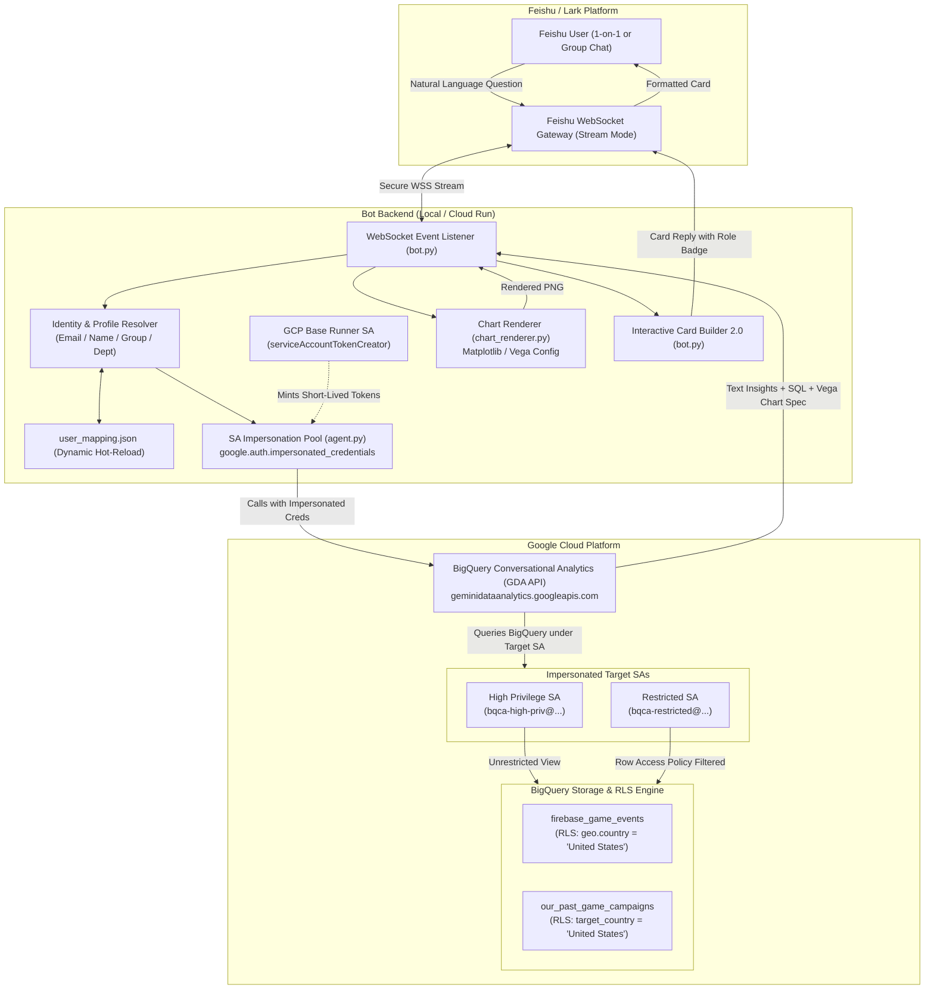
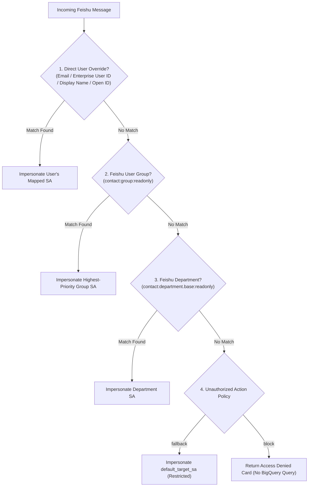

# Feishu Conversational Analytics Bot (BQCA Integration)

This project connects a **Feishu (Lark) Chatbot** directly to **Google Cloud BigQuery Conversational Analytics (BQCA)**, powered by Gemini in BigQuery.

Users can ask natural-language questions about their BigQuery datasets directly in Feishu (in 1-on-1 chats or by @-mentioning the bot in groups) and receive high-quality data insights, interactive tables, **automatically rendered visualization charts**, and collapsible generated SQL queries in beautifully formatted cards.

The bot features an enterprise-grade **Identity Mapping & Service Account Impersonation Engine** that enforces granular **Role-Based Access Control (RBAC)** and **BigQuery Row-Level Security (RLS)** based on the Feishu user's corporate identity.

---

## 1. Architecture Overview

### 1.1. System Architecture Diagram



---

## 2. Enterprise Identity Mapping & Impersonation Engine

To prevent data exfiltration and ensure least-privilege access, the bot avoids running all queries under a single shared service account. Instead, it dynamically **impersonates specific target Service Accounts** based on the requester's Feishu identity.

### 2.1. Hierarchical RBAC Resolution Flow

The identity resolution engine in `config.py` checks incoming messages against a 4-tier hierarchy:



### 2.2. Configuration File: `user_mapping.json`

The mapping configuration is stored in JSON format and is **hot-reloaded on every request** without requiring a service restart:

```json
{
  "unauthorized_action": "fallback",
  "default_target_sa": "bqca-restricted@your-gcp-project.iam.gserviceaccount.com",
  
  "users": {
    "lead_architect@company.com": {
      "name": "Lead Data Architect",
      "target_sa": "bqca-high-priv@your-gcp-project.iam.gserviceaccount.com",
      "description": "Full access to all global datasets and metrics"
    },
    "沃秉纲": {
      "name": "沃秉纲 (High Priv Lead)",
      "target_sa": "bqca-high-priv@your-gcp-project.iam.gserviceaccount.com",
      "description": "Matched directly by Feishu Display Name"
    },
    "ou_1f6974bb2fd623f21e4e75e44aa7ff07": {
      "name": "Direct OpenID Fallback",
      "target_sa": "bqca-restricted@your-gcp-project.iam.gserviceaccount.com"
    }
  },

  "groups": {
    "g_finance_executives": {
      "name": "Finance Executive Group",
      "target_sa": "bqca-high-priv@your-gcp-project.iam.gserviceaccount.com",
      "priority": 100
    },
    "g_regional_sales": {
      "name": "Regional Sales Team",
      "target_sa": "bqca-restricted@your-gcp-project.iam.gserviceaccount.com",
      "priority": 50
    }
  },

  "departments": {
    "od_global_bi_department": {
      "name": "Global BI Department",
      "target_sa": "bqca-high-priv@your-gcp-project.iam.gserviceaccount.com"
    }
  }
}
```

---

## 3. BigQuery Row-Level Security (RLS) Setup

BigQuery Row Access Policies enforce row-filtering natively in the storage layer. Even if BQCA generates broad SQL queries (such as `SELECT *`), BigQuery automatically filters rows based on the caller's target Service Account.

### Example Policy DDL

```sql
-- 1. High Privilege Policy (All Access)
CREATE OR REPLACE ROW ACCESS POLICY high_priv_all_access
ON `your-project.gaming_demo.firebase_game_events`
GRANT TO ('serviceAccount:bqca-high-priv@your-project.iam.gserviceaccount.com')
FILTER USING (TRUE);

-- 2. Restricted Policy (US Data Only)
CREATE OR REPLACE ROW ACCESS POLICY restricted_us_only
ON `your-project.gaming_demo.firebase_game_events`
GRANT TO ('serviceAccount:bqca-restricted@your-project.iam.gserviceaccount.com')
FILTER USING (geo.country = 'United States');

-- 3. High Privilege Policy for Campaigns Table
CREATE OR REPLACE ROW ACCESS POLICY campaigns_high_priv_all_access
ON `your-project.gaming_demo.our_past_game_campaigns`
GRANT TO ('serviceAccount:bqca-high-priv@your-project.iam.gserviceaccount.com')
FILTER USING (TRUE);

-- 4. Restricted Policy for Campaigns Table
CREATE OR REPLACE ROW ACCESS POLICY campaigns_restricted_us_only
ON `your-project.gaming_demo.our_past_game_campaigns`
GRANT TO ('serviceAccount:bqca-restricted@your-project.iam.gserviceaccount.com')
FILTER USING (target_country = 'United States');
```

---

## 4. GCP IAM & Service Account Provisioning

This architecture uses a **2-Tier Service Account Design** to enforce the principle of least privilege and strict separation of duties:

| Service Account | Role / Purpose | Direct BigQuery & Data Access? | Key IAM Permissions |
| :--- | :--- | :--- | :--- |
| **`bqca-base-runner`** | **Host Runtime Identity** (Attached to Cloud Run / Compute) | ❌ **None** (Zero data access) | `roles/iam.serviceAccountTokenCreator` on target SAs |
| **`bqca-high-priv`** | **Target Identity: Global Tier** (Impersonated on demand) | ✅ **Full Global Data** | `geminidataanalytics.dataAgentUser`, `bigquery.jobUser`, `high_priv_all_access` RLS |
| **`bqca-restricted`** | **Target Identity: US-Only Tier** (Impersonated on demand) | ✅ **Filtered US Data Only** | `geminidataanalytics.dataAgentUser`, `bigquery.jobUser`, `restricted_us_only` RLS |

### 4.1. Why `bqca-base-runner` is Needed

1. **Defense-in-Depth**: The bot application container runs under `bqca-base-runner`. Even if the container is compromised or a bug occurs, the attacker gains **zero direct access to BigQuery datasets** because `bqca-base-runner` has no BigQuery read permissions.
2. **Dynamic Delegation**: The base runner's only purpose is to authenticate against Google Cloud IAM and dynamically request short-lived (1-hour) OAuth2 access tokens for the target SAs (`bqca-high-priv` or `bqca-restricted`) via the `iamcredentials.googleapis.com` API.
3. **Audit Trail**: Cloud Audit Logs clearly differentiate between the container host identity (`bqca-base-runner`) and the impersonated data caller identity (`bqca-high-priv` / `bqca-restricted`).

### 4.2. Step 1: Create the Base Runner Service Account

```bash
# 1. Create the host runtime service account
gcloud iam service-accounts create bqca-base-runner \
    --description="Host runtime service account for Feishu BQCA Bot container" \
    --display-name="BQCA Base Runner SA"

# 2. Grant Token Creator role on target SAs to bqca-base-runner
gcloud iam service-accounts add-iam-policy-binding bqca-high-priv@your-project.iam.gserviceaccount.com \
    --member="serviceAccount:bqca-base-runner@your-project.iam.gserviceaccount.com" \
    --role="roles/iam.serviceAccountTokenCreator"

gcloud iam service-accounts add-iam-policy-binding bqca-restricted@your-project.iam.gserviceaccount.com \
    --member="serviceAccount:bqca-base-runner@your-project.iam.gserviceaccount.com" \
    --role="roles/iam.serviceAccountTokenCreator"
```

> [!NOTE]
> **Understanding the `add-iam-policy-binding` Syntax**:
> In Google Cloud IAM, Service Accounts act as **both identities and resources**.
> * The **first argument** (`bqca-high-priv@...`) is the **target resource** being protected.
> * The **`--member`** (`serviceAccount:bqca-base-runner@...`) is the **caller identity** being granted permission.
> * The **`--role="roles/iam.serviceAccountTokenCreator"`** grants `bqca-base-runner` permission to generate tokens *for* `bqca-high-priv`.
>
> *(This resource-level binding is Google Cloud's recommended least-privilege practice, ensuring `bqca-base-runner` can only impersonate these specific accounts rather than all accounts in the project).*

### 4.3. Step 2: Create and Provision Target Service Accounts

```bash
# 1. Create the target SAs
gcloud iam service-accounts create bqca-high-priv \
    --description="Target SA with unrestricted global BQCA data access" \
    --display-name="BQCA High Privilege SA"

gcloud iam service-accounts create bqca-restricted \
    --description="Target SA with US-restricted BQCA data access" \
    --display-name="BQCA Restricted SA"

# 2. Grant BQCA and BigQuery execution permissions to target SAs
for SA in bqca-high-priv bqca-restricted; do
    # Call BQCA agent
    gcloud projects add-iam-policy-binding your-project \
        --member="serviceAccount:${SA}@your-project.iam.gserviceaccount.com" \
        --role="roles/geminidataanalytics.dataAgentUser"

    # Run BigQuery query jobs
    gcloud projects add-iam-policy-binding your-project \
        --member="serviceAccount:${SA}@your-project.iam.gserviceaccount.com" \
        --role="roles/bigquery.jobUser"

    # Read BigQuery metadata and tables
    gcloud projects add-iam-policy-binding your-project \
        --member="serviceAccount:${SA}@your-project.iam.gserviceaccount.com" \
        --role="roles/bigquery.dataViewer"
done
```

---

## 5. Feishu App Configuration

1. **Enable Bot Capability**: In Feishu Open Platform, navigate to *App Capabilities > Bot* and enable the bot.
2. **Event Subscription (Stream Mode)**:
   * Select **Stream Mode (WebSocket)**.
   * Subscribe to event: **`im.message.receive_v1`** (Receive Message v1).
3. **Required Permission Scopes**:
   * **`im:message`**: Send and receive 1-on-1 messages.
   * **`im:message.group_at_msg`**: Receive @-mention messages in group chats.
   * **`im:chat`**: Acquire chat metadata and member names.
   * **`im:resource:upload` / `im:resource`**: Upload rendered chart PNGs to Feishu media storage.
   * **`contact:contact.base:readonly`** *(Optional)*: Read corporate user emails via Contact API.
   * **`contact:group:readonly`** *(Optional)*: Read user group memberships for group-based RBAC.
4. **Publish Version**: Create and submit a version release in *Version Management & Release*.

---

## 6. Project Structure

```
bqca-feishu/
├── .env                  # Local environment variable configuration
├── config.py             # Environment config loader & RBAC resolution engine
├── agent.py              # BQCA client with thread-safe SA impersonation pooling
├── bot.py                # Feishu WebSocket listener, universal parser, & card builder
├── chart_renderer.py     # Offline Vega-to-Matplotlib high-res chart renderer
├── user_mapping.json     # Dynamic user/group/department-to-SA mapping
├── Dockerfile            # Container definition for Cloud Run deployment
└── requirements.txt      # Python dependencies
```

---

## 7. Local Quickstart

1. **Clone & Setup Virtual Environment**:
   ```bash
   git clone <repo-url>
   cd bqca-feishu
   python3 -m venv .venv
   source .venv/bin/activate
   pip install -r requirements.txt
   ```

2. **Configure `.env`**:
   Create a `.env` file in the project root:
   ```ini
   FEISHU_APP_ID=cli_xxxxxxxxxxxxxxxx
   FEISHU_APP_SECRET=xxxxxxxxxxxxxxxxxxxxxxxxxxxxxxxx
   GCP_PROJECT=your-gcp-project-id
   GCP_LOCATION=global
   BQCA_CONFIG_ID=gda-xxxxxxxx-xxxx-xxxx-xxxx-xxxxxxxxxxxx
   USER_MAPPING_FILE=user_mapping.json
   ```

3. **Authenticate Local GCP ADC**:
   ```bash
   gcloud auth application-default login
   ```

4. **Launch the Bot**:
   ```bash
   PYTHONUNBUFFERED=1 python bot.py
   ```

---

## 8. Production Deployment to Google Cloud Run

Deploying to Cloud Run provides a managed, serverless execution environment with continuous health monitoring.

```bash
# 1. Build Container Image via Cloud Build
gcloud builds submit --tag gcr.io/your-project-id/bqca-feishu-bot

# 2. Deploy Service to Cloud Run
gcloud run deploy bqca-feishu-bot \
    --image=gcr.io/your-project-id/bqca-feishu-bot \
    --platform=managed \
    --region=us-central1 \
    --service-account="bqca-base-runner@your-project-id.iam.gserviceaccount.com" \
    --min-instances=1 \
    --max-instances=1 \
    --cpu=always \
    --no-allow-unauthenticated \
    --set-env-vars="FEISHU_APP_ID=your-feishu-app-id,FEISHU_APP_SECRET=your-feishu-app-secret,GCP_PROJECT=your-gcp-project-id,GCP_LOCATION=global,BQCA_CONFIG_ID=your-bqca-agent-id"
```

> [!NOTE]
> Cloud Run Services require binding to an HTTP port during startup. The application automatically runs a lightweight background HTTP probe on port `8080` to satisfy health check probes without interrupting the WebSocket event loop.

---

## 9. Key Resilience & UX Features

* **Universal Message Parsing**: Seamlessly processes standard `text` and formatted rich-text `post` messages, stripping redundant quote marks and Feishu XML tags.
* **Heterogeneous Schema Normalization**: Intelligently creates the union of all column keys when BQCA executes multiple heterogeneous SQL queries, preventing Feishu card validation errors (`230099 / 200915`).
* **Visual Identity Badges**: Displays the active authenticated role context directly in the card header (e.g. `🛡️ Role Context: 沃秉纲 (High Priv Lead) (bqca-high-priv)`).
* **Automatic Fallback Safety**: If interactive card rendering fails for any reason, the bot falls back to formatted text message replies automatically.
* **Stateless Token Management**: Caches impersonated client instances with thread safety, automatically refreshing short-lived GCP tokens.
* **Interactive Card UI (Schema 2.0)**:
  * **Synthesized Insights Body**: Formatted markdown analysis with bullet points.
  * **Scrollable Tables**: Paginated data tables for multi-row results.
  * **📊 Data Visualizations**: High-res Matplotlib chart images generated from BQCA Vega specs.
  * **🔍 Collapsible SQL Panel**: Expandable code block containing generated BigQuery SQL.
  * **💡 Suggested Follow-up Questions**: Contextual recommendations for next steps.
